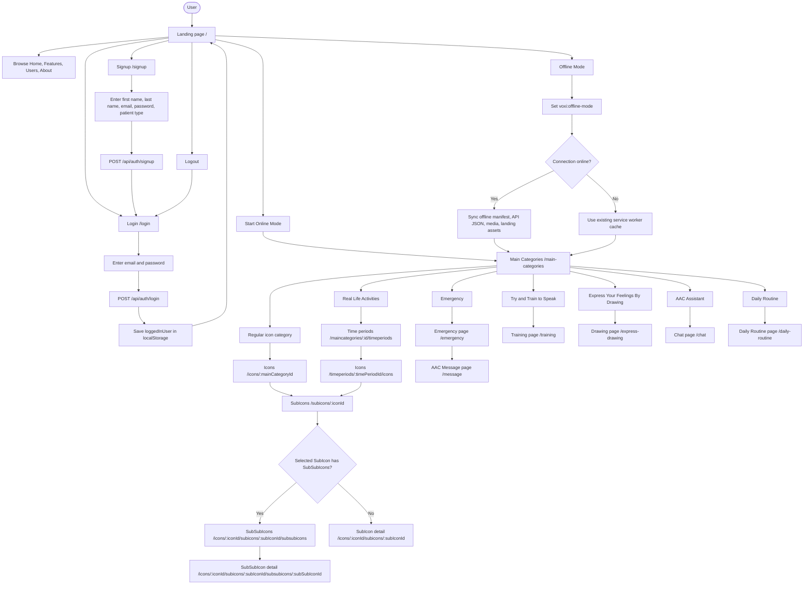
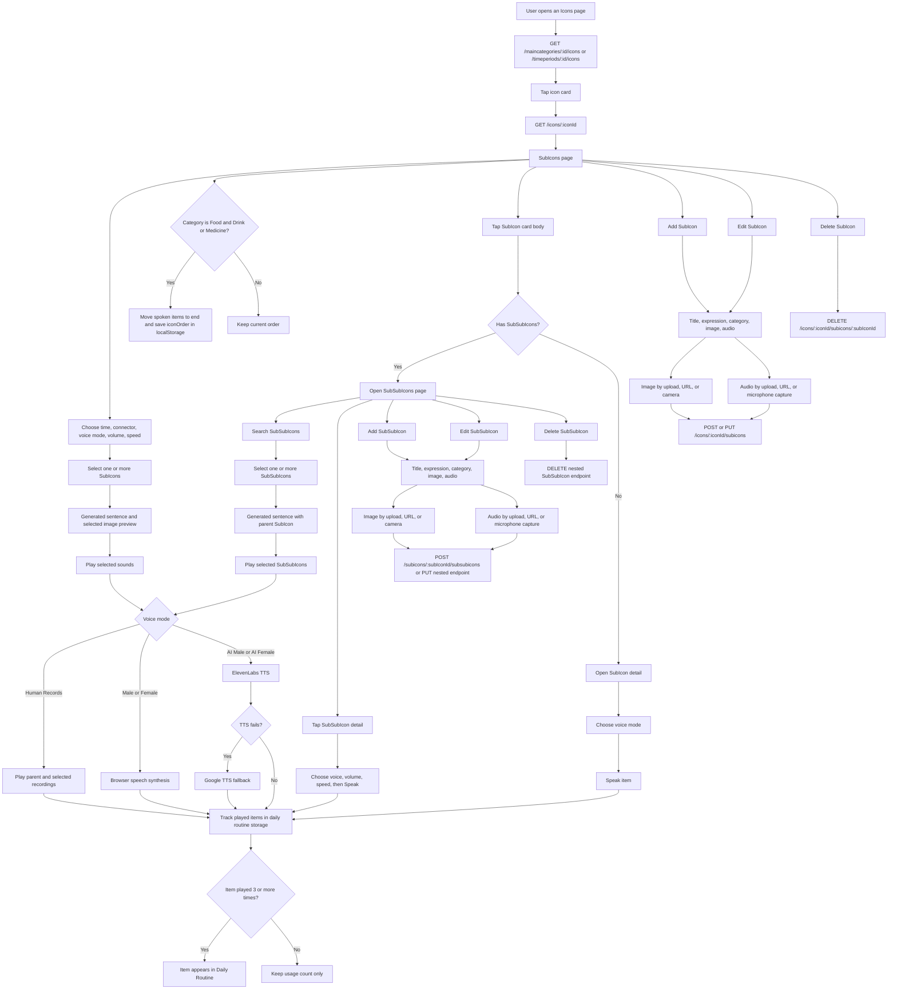
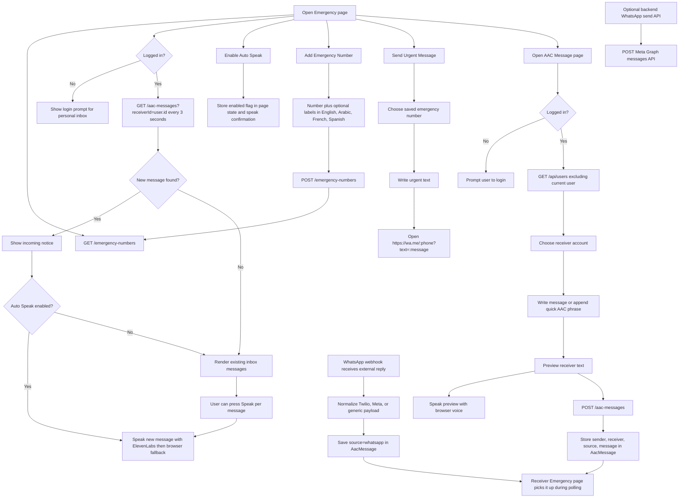
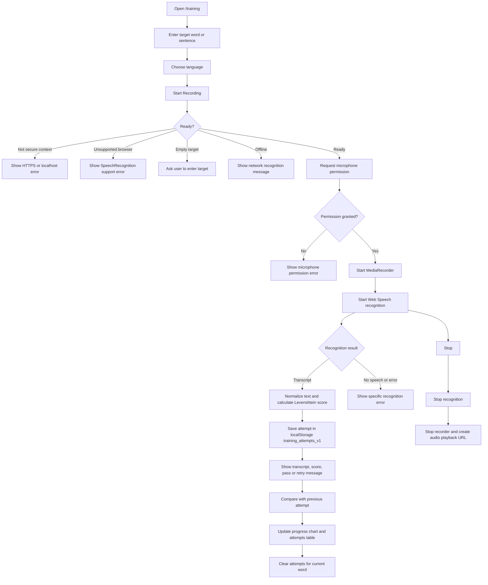
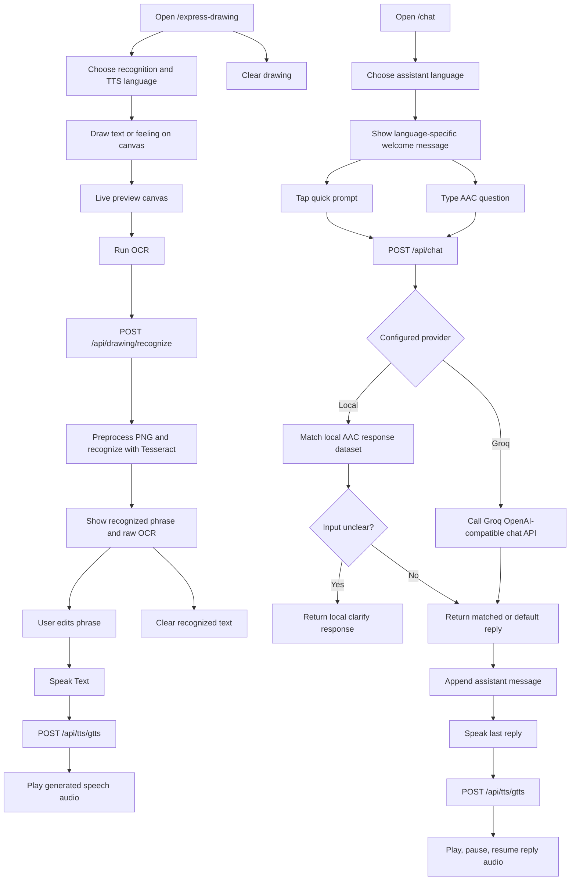
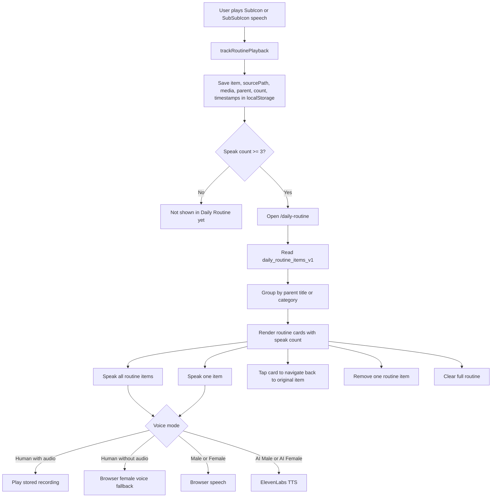
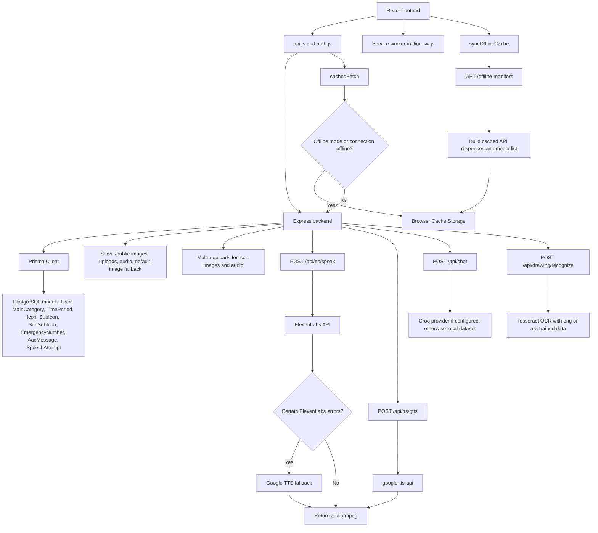
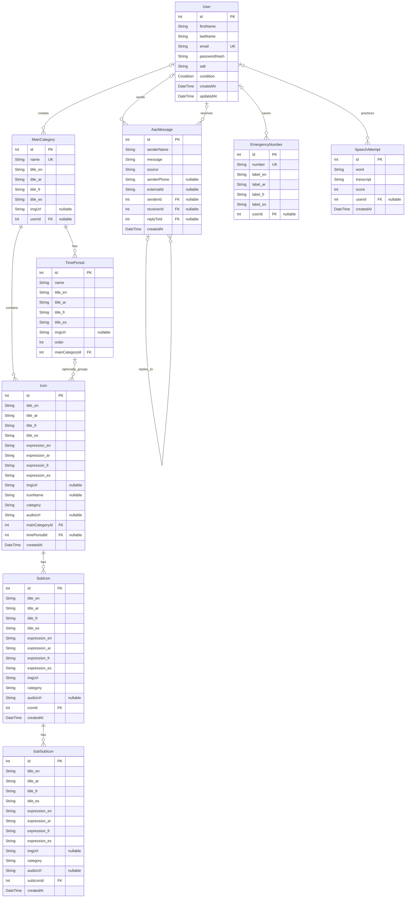

# Voxi User Flow - Mermaid

This document maps the current app features from the React routes, page behavior, API helpers, and Express endpoints.

## 1. Overall App Navigation

## 2. AAC Icons, Speech, and Content Management

## 3. Emergency, AAC Messages, and WhatsApp

## 4. Speech Training

## 5. Drawing Recognition and AAC Assistant

## 6. Daily Routine

## 7. Backend and Offline Support

## 8. Relational Tables / ERD

